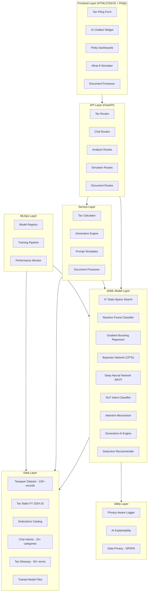
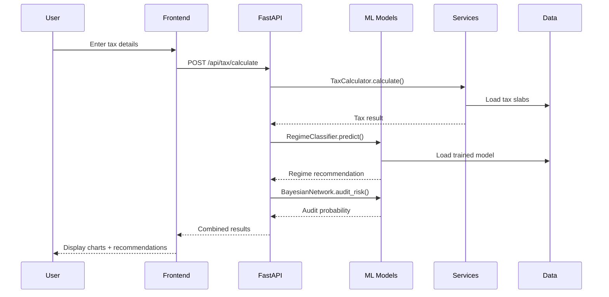
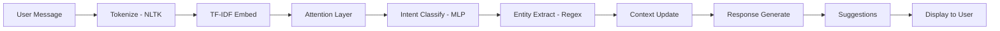
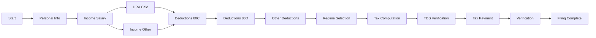

# System Architecture Diagram

## High-Level Architecture

```mermaid
graph TB
    subgraph Frontend["Frontend Layer (HTML/CSS/JS + Plotly)"]
        UI[Tax Filing Form]
        Chat[AI Chatbot Widget]
        Dash[Plotly Dashboards]
        Sim[What-If Simulator]
        DocUp[Document Processor]
    end

    subgraph API["API Layer (FastAPI)"]
        TR[Tax Routes]
        CR[Chat Routes]
        AR[Analysis Routes]
        SR[Simulator Routes]
        DR[Document Routes]
    end

    subgraph AI["AI/ML Model Layer"]
        AStar["A* State-Space Search"]
        RFC["Random Forest Classifier"]
        GBR["Gradient Boosting Regressor"]
        BN["Bayesian Network (CPTs)"]
        DNN["Deep Neural Network (MLP)"]
        NLP["NLP Intent Classifier"]
        ATT["Attention Mechanism"]
        GenAI["Generative AI Engine"]
        Rec["Deduction Recommender"]
    end

    subgraph Services["Service Layer"]
        TC[Tax Calculator]
        GE[Generative Engine]
        PT[Prompt Templates]
        DP[Document Processor]
    end

    subgraph Utils["Utility Layer"]
        Log[Privacy-Aware Logger]
        Exp[AI Explainability]
        Priv[Data Privacy - DPDPA]
    end

    subgraph Data["Data Layer"]
        CSV[Taxpayer Dataset - 130+ records]
        JSON1[Tax Slabs FY 2024-25]
        JSON2[Deductions Catalog]
        JSON3[Chat Intents - 25+ categories]
        JSON4[Tax Glossary - 50+ terms]
        PKL[Trained Model Files]
    end

    subgraph MLOps["MLOps Layer"]
        Reg[Model Registry]
        Pipe[Training Pipeline]
        Mon[Performance Monitor]
    end

    Frontend --> API
    API --> AI
    API --> Services
    Services --> AI
    AI --> Data
    Services --> Data
    AI --> Utils
    MLOps --> AI
    MLOps --> Data
```

## Data Flow

```mermaid
sequenceDiagram
    participant U as User
    participant F as Frontend
    participant A as FastAPI
    participant ML as ML Models
    participant S as Services
    participant D as Data

    U->>F: Enter tax details
    F->>A: POST /api/tax/calculate
    A->>S: TaxCalculator.calculate()
    S->>D: Load tax slabs
    S-->>A: Tax result
    A->>ML: RegimeClassifier.predict()
    ML->>D: Load trained model
    ML-->>A: Regime recommendation
    A->>ML: BayesianNetwork.audit_risk()
    ML-->>A: Audit probability
    A-->>F: Combined results
    F-->>U: Display charts + recommendations
```

## Chatbot NLP Pipeline

```mermaid
graph LR
    A[User Message] --> B[Tokenize - NLTK]
    B --> C[TF-IDF Embed]
    C --> D[Attention Layer]
    D --> E[Intent Classify - MLP]
    E --> F[Entity Extract - Regex]
    F --> G[Context Update]
    G --> H[Response Generate]
    H --> I[Suggestions]
    I --> J[Display to User]
```

## A* Search State Space

```mermaid
graph LR
    S[Start] --> PI[Personal Info]
    PI --> IS[Income Salary]
    IS --> HRA[HRA Calc]
    IS --> IO[Income Other]
    HRA --> D80C[Deductions 80C]
    IO --> D80C
    D80C --> D80D[Deductions 80D]
    D80D --> DO[Other Deductions]
    DO --> RS[Regime Selection]
    RS --> TC[Tax Computation]
    TC --> TDS[TDS Verification]
    TDS --> TP[Tax Payment]
    TP --> V[Verification]
    V --> FC[Filing Complete]
```
